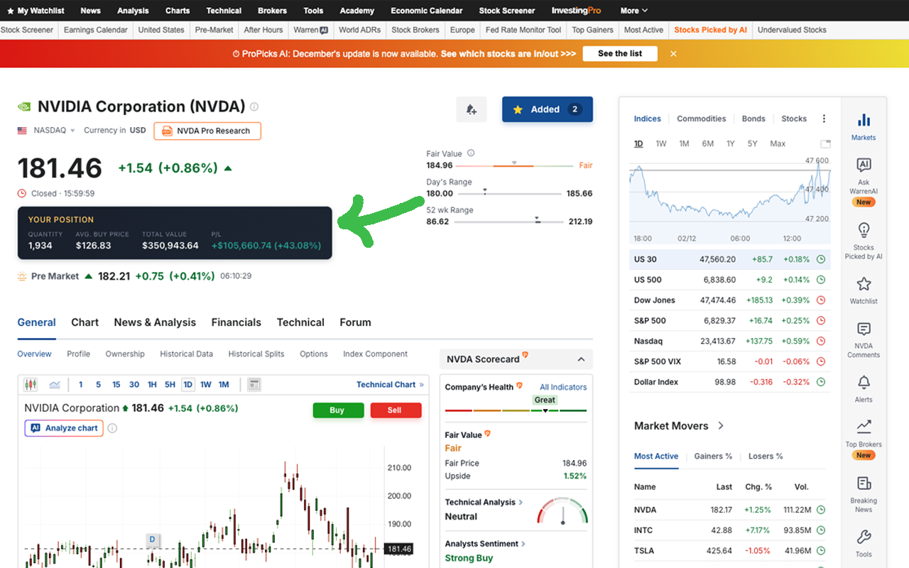
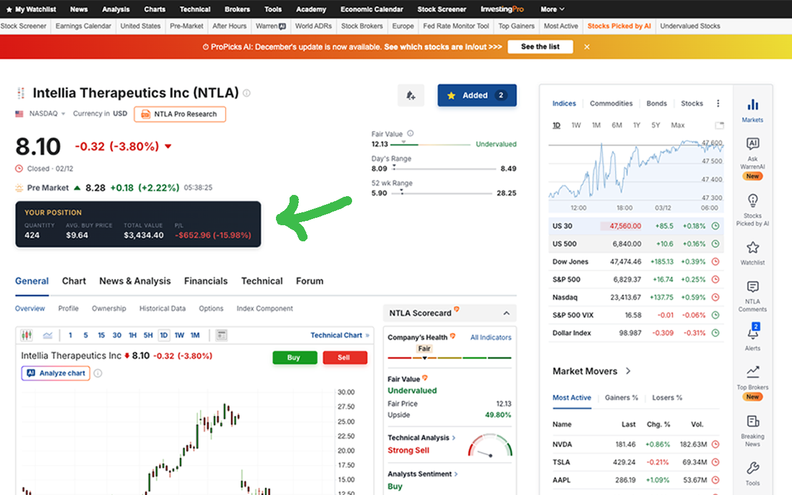
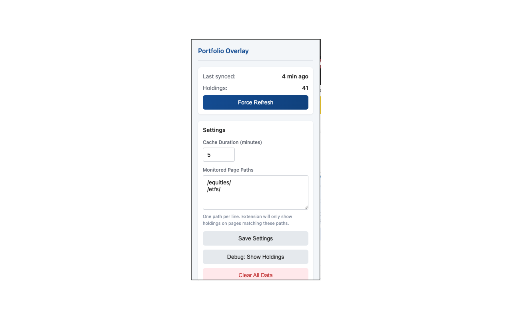

# Investing.com Portfolio Overlay

A Chrome extension that displays your portfolio holdings directly on investing.com asset pages.

## What it does

When you browse stock or ETF pages on investing.com, this extension shows a panel with your position details:

- **Quantity** - Number of shares you own
- **Average Buy Price** - Your cost basis
- **Total Value** - Current market value of your position (updates in real-time)
- **P/L** - Profit/loss amount and percentage (updates in real-time)

The extension automatically aggregates holdings across all your portfolios and updates Total Value and P/L in real-time as the page price changes.

## Screenshots

### Position Panel on Asset Page

### Extension Settings

## Installation

1. Open `chrome://extensions/` in Chrome
2. Enable "Developer mode" (top right)
3. Click "Load unpacked"
4. Select the `investing_com_extension` folder

## Usage

1. Log in to your investing.com account
2. Visit any equity or ETF page (e.g., `/equities/apple-computer-inc`)
3. If you own that asset, your position details will appear on the page

Click the extension icon to:
- Force refresh portfolio data
- Adjust cache duration
- Configure which page paths to monitor

## Requirements

- Chrome browser
- Active investing.com account with portfolio holdings

## Known Problems

### Portfolio Fetch Redirect Issue

When fetching individual portfolio data, the investing.com server sometimes redirects requests to the main portfolio page instead of returning the specific portfolio requested. This causes the extension to receive holdings from the wrong portfolio.

**Symptoms:**
- Some portfolios may show missing holdings
- Debug output shows "mismatch" errors for certain portfolios

**Mitigation:**
The extension implements a two-round retry mechanism:
1. First round fetches all portfolios quickly and saves successful results immediately
2. Failed portfolios are retried with 10-second delays between each attempt

This retry mechanism helps in many cases but does not guarantee 100% success rate. If you notice missing holdings, try clicking "Force Refresh" in the extension popup.

## Credits

Most of the code in this project was generated with [Claude](https://claude.ai) by Anthropic.
